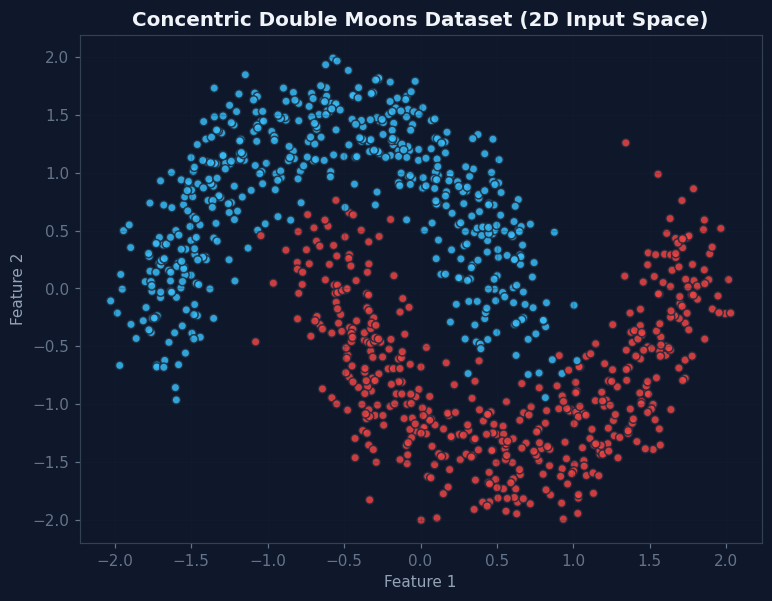
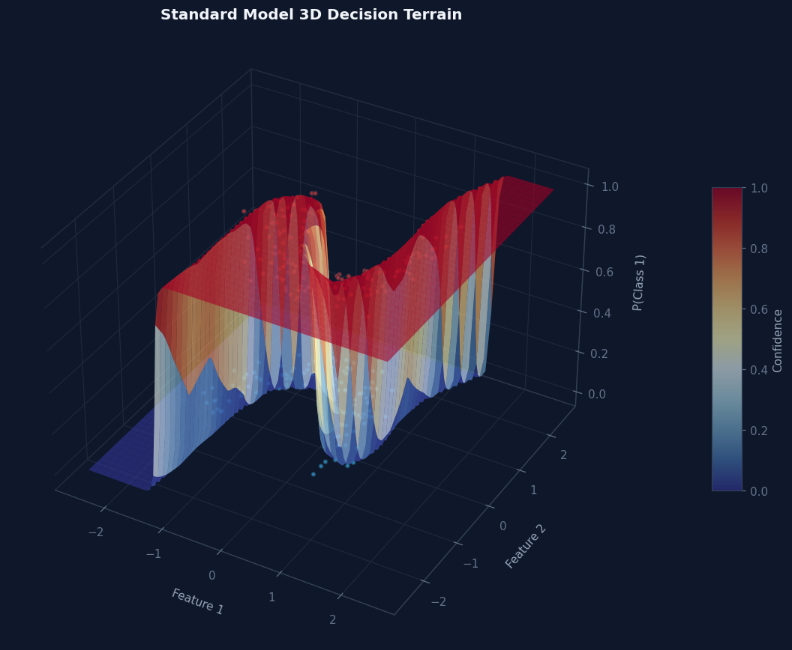
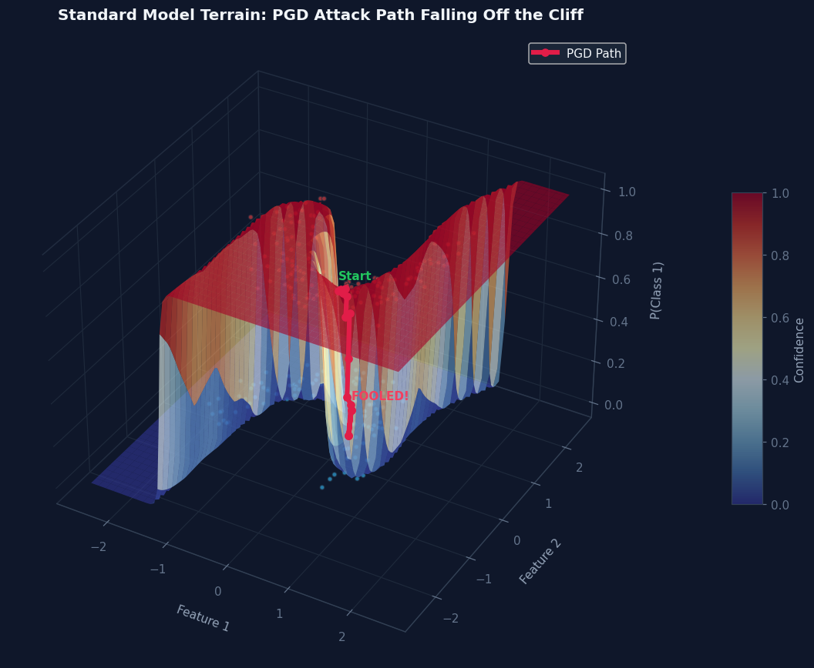
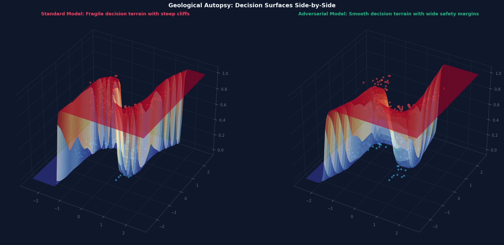
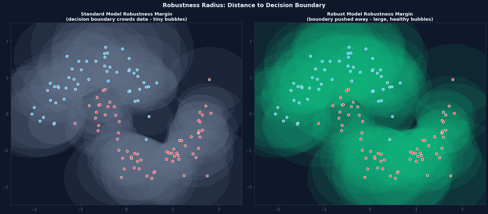
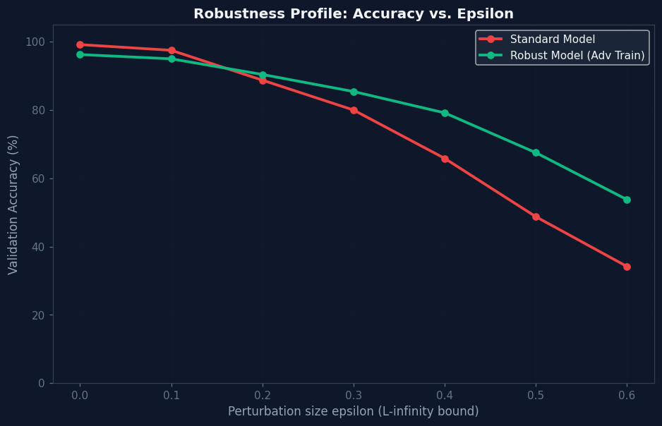

# 🌋 Adversarial Geology: Mapping the Treacherous Decision Surfaces of Neural Networks

**Visualize how adversarial attacks navigate the jagged cliffs of neural network decision boundaries in 3D**



This notebook explores the fragile geometry of neural network decision boundaries by:
- Training a standard MLP on a 2D "double moons" dataset
- Generating adversarial examples using FGSM and PGD attacks
- Mapping the 3D decision surface topography
- Tracking attack trajectories as they "fall off cliffs"
- Comparing standard vs. adversarially robust models

---

## 📖 Overview

### The Problem: Fragile Decision Boundaries
Neural networks create highly non-linear decision boundaries that appear smooth in low dimensions but become treacherous mountain ranges in high-dimensional space. A single-pixel perturbation can teleport an input from a safe plateau to a steep cliff, causing misclassification.

### The Solution: Geological Mapping
This notebook:
1. **Trains** a 4-layer MLP on synthetic 2D data
2. **Attacks** it using FGSM and PGD adversarial methods
3. **Visualizes** the 3D decision surface topography
4. **Tracks** attack trajectories across the terrain
5. **Compares** standard vs. robust models

### Key Insights
- Standard models have jagged, cliff-like decision boundaries near data points
- Adversarial training flattens these cliffs into smooth valleys
- Robust models push decision boundaries farther from data points
- Attack trajectories reveal the "path of least resistance" to misclassification

---

## 🗂️ Notebook Structure

| Section | Description |
|--------|-------------|
| **1. Setup & Configurations** | Auto-installs libraries and sets dark theme styling |
| **2. Theory: The Geometry of Adversaries** | Mathematical foundations of FGSM, PGD, and robust optimization |
| **3. Dataset: Double Moons** | Generates and visualizes the 2D classification dataset |
| **4. MLP Classifier Architecture** | Defines the 4-layer fully connected network |
| **5. Standard Model Training** | Trains baseline model to 99%+ accuracy |
| **6. Adversarial Attack Engines** | Implements FGSM and PGD attacks in PyTorch |
| **7. Mapping the 3D Decision Terrain** | Renders the probability surface in 3D |
| **8. Tracking Attack Trajectories** | Visualizes PGD attack paths across the decision surface |
| **9. Robust Optimization** | Implements adversarial training |
| **10. Geological Comparison** | Side-by-side 3D visualization of standard vs. robust models |
| **11. Robustness Radius** | Plots safety margins around validation points |
| **12. Epsilon Sweep Analysis** | Compares accuracy vs. perturbation size |
| **13. Interactive Geology Scrubber** | Real-time control of model parameters |
| **14. Summary & LinkedIn Post Kit** | Ready-to-use social media templates |

---

## 🔬 Key Techniques & Libraries

### Core Libraries
| Library | Purpose |
|--------|---------|
| `torch` | Neural network training and adversarial attacks |
| `matplotlib` | 2D/3D visualizations |
| `seaborn` | Enhanced plotting aesthetics |
| `scikit-learn` | Dataset generation |
| `ipywidgets` | Interactive controls |

### Key Methods
| Technique | Implementation |
|-----------|----------------|
| **FGSM Attack** | Single-step gradient sign method |
| **PGD Attack** | Iterative projected gradient descent |
| **Adversarial Training** | Minimax robust optimization |
| **3D Surface Mapping** | Probability grid extrapolation |
| **Trajectory Tracking** | Step-by-step attack path logging |
| **Robustness Radius** | Safety margin calculation |

### Mathematical Foundations
```math
\text{FGSM: } x_{adv} = x + \epsilon \cdot \text{sign}(\nabla_x \mathcal{L}(\theta, x, y))
```
```math
\text{PGD: } x^{t+1} = \Pi_{x + \mathcal{S}} \left( x^t + \alpha \cdot \text{sign}(\nabla_{x^t} \mathcal{L}(\theta, x^t, y)) \right)
```
```math
\text{Robust Optimization: } \min_{\theta} \mathbb{E}_{(x,y) \sim \mathcal{D}} \left[ \max_{\|\delta\|_\infty \le \epsilon} \mathcal{L}(\theta, x + \delta, y) \right]
```

---

## 🚀 How to Run

### Prerequisites
- Python 3.8+
- Jupyter Notebook/Lab
- CUDA-capable GPU (recommended)

### Installation
```bash
# Clone repository (if applicable)
git clone <repository-url>
cd <repository-directory>

# Create virtual environment
python -m venv venv
source venv/bin/activate  # Linux/Mac
venv\Scripts\activate     # Windows

# Install dependencies
pip install torch matplotlib seaborn scikit-learn ipywidgets jupyter
```

### Running the Notebook
```bash
jupyter notebook Adversarial_Geology.ipynb
```

### Expected Runtime
| Component | Time (CPU) | Time (GPU) |
|-----------|------------|------------|
| Model Training | ~2 minutes | ~30 seconds |
| 3D Visualization | ~1 minute | ~1 minute |
| Adversarial Attacks | ~30 seconds | ~10 seconds |

---

## 📊 Results & Insights

### 1. Dataset Visualization

*Figure 1: The 2D "double moons" dataset used for classification. Blue and red points represent the two classes.*

### 2. Standard Model Decision Surface

*Figure 2: 3D decision surface of the standard model. Note the steep cliffs near data points where small perturbations cause misclassification.*

### 3. Attack Trajectory

*Figure 3: PGD attack trajectory (red line) showing how an input is pushed across the decision boundary. The green "Start" and red "FOOLED!" labels mark the beginning and end of the attack.*

### 4. Robust vs. Standard Model Comparison

*Figure 4: Side-by-side comparison of standard (left) vs. robust (right) model decision surfaces. The robust model shows smoother terrain with boundaries pushed farther from data points.*

### 5. Robustness Radius

*Figure 5: 2D bubble chart showing the robustness radius around validation points. Larger bubbles indicate greater safety margins against adversarial attacks.*

### 6. Epsilon Sweep Analysis

*Figure 6: Validation accuracy vs. perturbation size (ε) for standard and robust models. The robust model maintains higher accuracy under increasing attack strength.*

### Key Findings
1. **Cliff-Like Boundaries**: Standard models create steep decision cliffs where small perturbations cause dramatic confidence changes
2. **Attack Paths**: PGD attacks follow the "path of least resistance" across the decision surface
3. **Robustness Benefits**: Adversarial training flattens decision surfaces and increases safety margins
4. **Trade-offs**: Robust models sacrifice some clean accuracy for improved adversarial robustness

---

## 💡 Possible Extensions

| Extension | Description |
|-----------|-------------|
| **Higher-Dimensional Data** | Extend to 3D/4D datasets with dimensionality reduction for visualization |
| **Advanced Attacks** | Implement CW, DeepFool, or AutoAttack for stronger adversaries |
| **Defense Mechanisms** | Add randomized smoothing, defensive distillation, or gradient masking |
| **Real-World Datasets** | Apply to MNIST, CIFAR-10, or medical imaging data |
| **Interactive 3D** | Use Plotly or Three.js for browser-based 3D exploration |
| **Explainability** | Integrate SHAP or LIME to explain decision surface features |
| **Automated Pipeline** | Create a reusable Python package for adversarial geology analysis |
| **Benchmarking** | Compare different architectures (CNNs, Transformers) on decision surface complexity |
| **Theoretical Analysis** | Derive mathematical relationships between surface curvature and robustness |
| **Educational Tool** | Develop an interactive tutorial with sliders for model parameters |

---

## 📊 Contributors

### Omar Hany Darwish

- **GitHub**: [OmarHanyDarwish](https://github.com/OmarDarwish483)
- **LinkedIn**: [Omar Hany Darwish](https://www.linkedin.com/in/omardrwish/)
- **Email**: darwishomar158@gmail.com